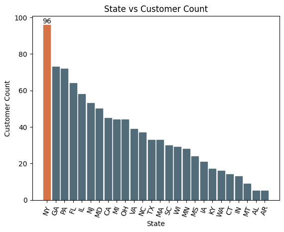
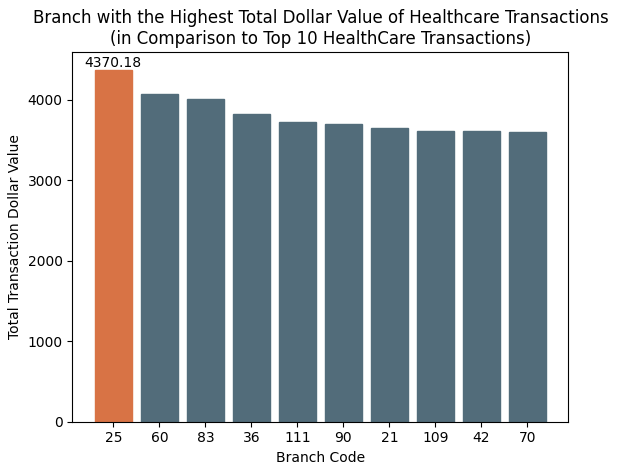
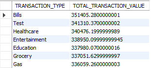

# Credit Card Transactions Management System

## Scope of Work
The purpose of this project is to demonstrate various skills associated with the data engineering course by Per Scholas. Accessing provided data files to query or provide visualization. Program will access cimple customer, credit card, bank branch, and load data, as well as display requested data for required queries.

The program provides a console interface with options for 7 different requested queries. 

### Required Queries
- Display the transactions made by customers living in a given zip code for a given month and year. Order by day in descending order.
- Display the number and total values of transactions for a given type.
- Display the total number and total values of transactions for branches in a given state.
- Check the existing account details of a customer.
- Modify the existing account details of a customer.
- Generate a monthly bill for a credit card number for a given month and year.
- Display the transactions made by a customer between two dates. Order by year, month, and day in descending order.

### Some of the Visualization

The total number of customers for each state. NY has the highest amount with a total of 96 customers.  

The bank branch with the highest dollar value transaction is Branch 25 for HealthCare.  
- Just some interesting perspective but HealthCare is not the highest total dollar transactional value.

HealthCare is the 3rd highest total value and Branch 25 is in MI state.

- Rest of the visualizations are in the `img` folder.

### Installing and Running the Program
Program writes to MYSQL database. A database called creditcard_capstone is needed. SQL files can be found in 'sql' folder. The tables for the database are taken from the data files in data folder. Some python libraries are needed. Configurations and some python libraries needed are in src folder.

To run the program, run the `__main__.py` file on terminal. This will display two main choices: queries and visualizations. Selected choice will lead to more options.

## Conclusion
This project was a modest effort aimed at showcasing some proficiency in data engineering. Skills include:
* MYSQL RDBMS
* matplotlib, pyspark
* Get requests and response
* Python

##### Things personally could have worked on with more time:
* Adding and removing customers
* Donut visualizations for loan data
* Database schema with more detailed contraints
* Turn running program into executable